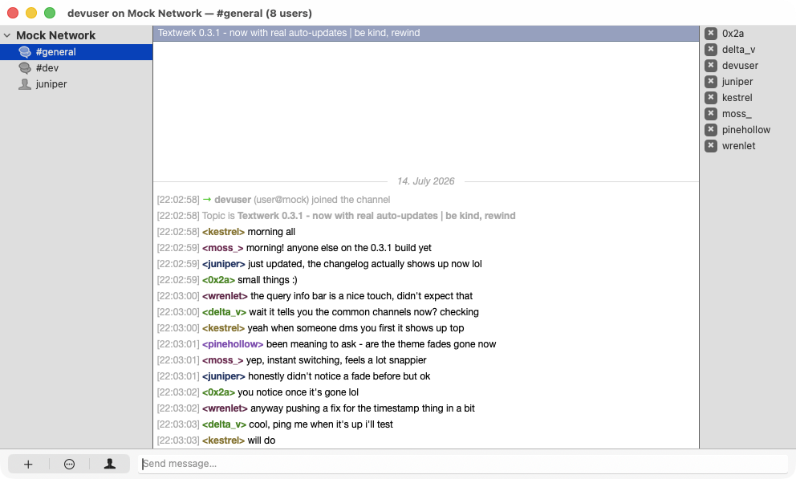
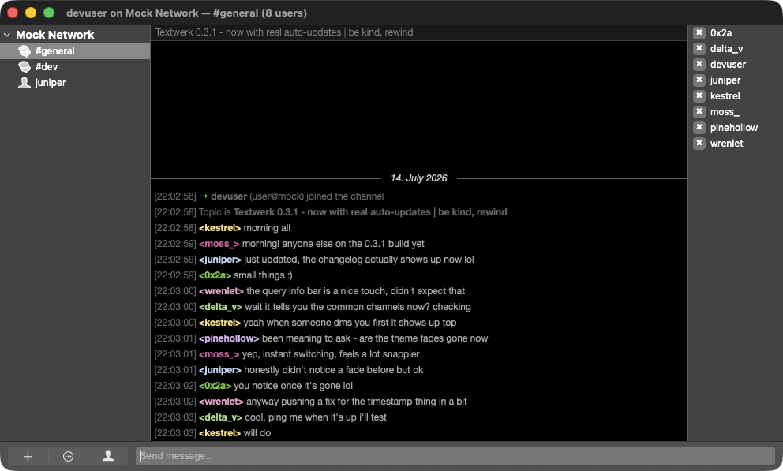

# Textwerk

A community fork of [Textual](https://github.com/Codeux-Software/Textual), the macOS IRC client originally built by Codeux Software. The upstream project is archived. Textwerk modernizes the codebase and targets macOS 26+.

**What changed from upstream:**
- Fixed crashes and blank channel views on macOS 26
- Fixed IRC connection crashes on macOS 26 (NWError.wifiAware handling)
- Core JavaScript is now injected via `WKUserScript` instead of `document.write` — more reliable script initialization
- Text-to-speech migrated from deprecated `NSSpeechSynthesizer` to `AVSpeechSynthesizer`
- Modern keychain APIs for client-side TLS certificate authentication
- Removed the license manager, OTR/Blowfish encryption, and WK1 WebView (all dead code)
- Removed FAQ, privacy, license, support, and help search from the Help menu
- Replaced `OELReachability` with `NWPathMonitor` (Network.framework)
- Removed all git submodule dependencies
- Targeting macOS 26+; no backward-compat cruft

## Screenshots




## How to install

### Download a release

Grab the latest build from the [Releases](https://github.com/bashgeek/Textwerk/releases) page and unzip it into your Applications folder.

Releases are unsigned. macOS will block the app on first launch. To open it anyway, right-click the app and choose **Open**, then confirm in the dialog. Alternatively, remove the quarantine attribute from the terminal:

```sh
xattr -d com.apple.quarantine /Applications/Textwerk.app
```

### Build from source

You need Xcode 16+ and a valid code signing identity (does not need to be issued by Apple).

Set your signing identity in `Configurations/Build/Code Signing Identity.xcconfig` before building. Do not change it through Xcode.

```sh
git clone https://github.com/bashgeek/Textwerk.git
cd Textwerk
./build.sh
```

The built app lands in `./build/Textwerk.app`.

<details>
<summary>Manual xcodebuild invocation</summary>

```sh
xcodebuild \
  -project "Sources/App/Textwerk App.xcodeproj" \
  -scheme "Textwerk (Standard Release)" \
  -derivedDataPath ./build/DerivedData \
  CONFIGURATION_BUILD_DIR=./build \
  build
```

</details>

## Migrating from Textual

If you're coming from the Mac App Store version or the standalone version from codeux.com, Textwerk will detect your existing settings on first launch and offer to import your servers, channels, and preferences.

You can also trigger this at any time from **Help → Advanced → Import from Previous Textual…**

## License

Textual began as a fork of [LimeChat](https://github.com/psychs/limechat) in 2010.

**LimeChat** (BSD 2-Clause)
Copyright (c) 2008-2010 Satoshi Nakagawa

**Textual** (BSD 3-Clause)
Copyright (c) 2010-2020 Codeux Software, LLC & respective contributors

Both licenses require preserving copyright notices in source and binary distributions. The name "Textual" and "Codeux Software, LLC" may not be used to promote products derived from this software without prior written permission.

Full license text for both is reproduced below.

<details>
<summary>LimeChat license</summary>

```
The New BSD License

Copyright (c) 2008 - 2010 Satoshi Nakagawa <psychs AT limechat DOT net>
All rights reserved.

Redistribution and use in source and binary forms, with or without
modification, are permitted provided that the following conditions
are met:
1. Redistributions of source code must retain the above copyright
   notice, this list of conditions and the following disclaimer.
2. Redistributions in binary form must reproduce the above copyright
   notice, this list of conditions and the following disclaimer in the
   documentation and/or other materials provided with the distribution.

THIS SOFTWARE IS PROVIDED BY THE AUTHOR AND CONTRIBUTORS ``AS IS'' AND
ANY EXPRESS OR IMPLIED WARRANTIES, INCLUDING, BUT NOT LIMITED TO, THE
IMPLIED WARRANTIES OF MERCHANTABILITY AND FITNESS FOR A PARTICULAR PURPOSE
ARE DISCLAIMED. IN NO EVENT SHALL THE AUTHOR OR CONTRIBUTORS BE LIABLE
FOR ANY DIRECT, INDIRECT, INCIDENTAL, SPECIAL, EXEMPLARY, OR CONSEQUENTIAL
DAMAGES (INCLUDING, BUT NOT LIMITED TO, PROCUREMENT OF SUBSTITUTE GOODS
OR SERVICES; LOSS OF USE, DATA, OR PROFITS; OR BUSINESS INTERRUPTION)
HOWEVER CAUSED AND ON ANY THEORY OF LIABILITY, WHETHER IN CONTRACT, STRICT
LIABILITY, OR TORT (INCLUDING NEGLIGENCE OR OTHERWISE) ARISING IN ANY WAY
OUT OF THE USE OF THIS SOFTWARE, EVEN IF ADVISED OF THE POSSIBILITY OF
SUCH DAMAGE.
```

</details>

<details>
<summary>Textual license</summary>

```
Copyright (c) 2010 - 2020 Codeux Software, LLC & respective contributors.

Redistribution and use in source and binary forms, with or without
modification, are permitted provided that the following conditions
are met:

   * Redistributions of source code must retain the above copyright
     notice, this list of conditions and the following disclaimer.
   * Redistributions in binary form must reproduce the above copyright
     notice, this list of conditions and the following disclaimer in the
     documentation and/or other materials provided with the distribution.
   * Neither the name of Textual, "Codeux Software, LLC", nor the
     names of its contributors may be used to endorse or promote products
     derived from this software without specific prior written permission.

THIS SOFTWARE IS PROVIDED BY THE AUTHOR AND CONTRIBUTORS ``AS IS'' AND
ANY EXPRESS OR IMPLIED WARRANTIES, INCLUDING, BUT NOT LIMITED TO, THE
IMPLIED WARRANTIES OF MERCHANTABILITY AND FITNESS FOR A PARTICULAR PURPOSE
ARE DISCLAIMED. IN NO EVENT SHALL THE AUTHOR OR CONTRIBUTORS BE LIABLE
FOR ANY DIRECT, INDIRECT, INCIDENTAL, SPECIAL, EXEMPLARY, OR CONSEQUENTIAL
DAMAGES (INCLUDING, BUT NOT LIMITED TO, PROCUREMENT OF SUBSTITUTE GOODS
OR SERVICES; LOSS OF USE, DATA, OR PROFITS; OR BUSINESS INTERRUPTION)
HOWEVER CAUSED AND ON ANY THEORY OF LIABILITY, WHETHER IN CONTRACT, STRICT
LIABILITY, OR TORT (INCLUDING NEGLIGENCE OR OTHERWISE) ARISING IN ANY WAY
OUT OF THE USE OF THIS SOFTWARE, EVEN IF ADVISED OF THE POSSIBILITY OF
SUCH DAMAGE.
```

</details>

### Third-party software

Textwerk bundles or links against the following third-party components:

| Component | License | Copyright |
|---|---|---|
| [GRMustache](https://github.com/groue/GRMustache) | MIT | (c) 2014 Gwendal Roué |
| [AutoHyperlinks Framework](https://github.com/Codeux-Software/AutoHyperlinks) | BSD 3-Clause | (c) 2005-2011 The Adium Team, (c) 2011 Codeux Software, LLC |
| [CocoaAsyncSocket](https://github.com/robbiehanson/CocoaAsyncSocket) (`GCDAsyncSocket`) | Public Domain | Originally by Robbie Hanson; maintained by Deusty LLC |
| [Colloquy](https://github.com/Colloquy/colloquy) (Chat Core) | BSD-style | (c) 2000-2012 the Colloquy IRC Client — used for a portion of SASL authentication handling in `IRCClient.m` |
| [Sparkle](https://github.com/sparkle-project/Sparkle) | MIT (plus bundled bsdiff, sais-lite, ed25519, and `SUSignatureVerifier` components under their own permissive licenses) | (c) 2006-2017 Andy Matuschak and contributors |

The "Cocoa Extensions" internal helper framework also carries a small number of third-party snippets (Dave Dribin's MIT-licensed code, an Apple sample-code snippet, and a Chromium-derived NSString helper) — see `Frameworks/Cocoa Extensions/ACKNOWLEDGEMENT.txt`, which ships inside the app bundle alongside the framework.
